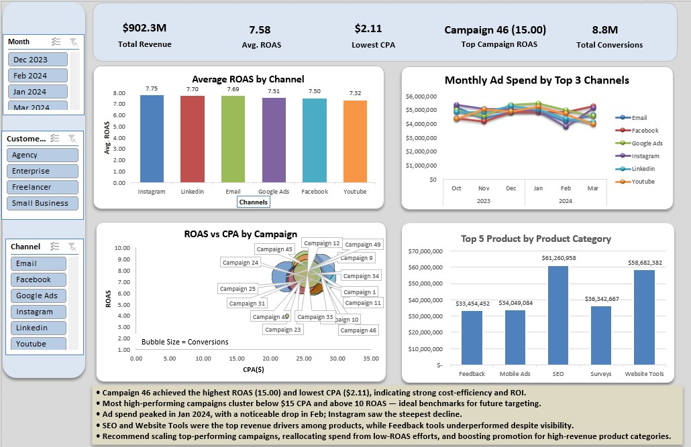

# Project Title: Marketing Campaign Performance Dashboard

A dynamic Excel dashboard built to analyse the performance of digital marketing campaigns across various advertising platforms. The goal was to uncover trends, optimise media spend, identify high-performing campaigns and products, and support data-driven decision-making for campaign strategy and budget allocation.

[Live Dashboard](https://1drv.ms/x/c/d78ee2cb960fe2f3/IQBwdEap3zgHSoNVp8EIMNy5Aa6SzsjlncZE2UBWarlNf18?e=cYKLOj)

---

## Table of Contents

- [Overview](#overview)
- [Dataset](#dataset)
- [Technologies Used](#technologies-used)
- [Installation](#installation)
- [Usage](#usage)
- [Analysis & Visualizations](#analysis--visualizations)
- [Conclusion](#conclusion)
- [Credits](#credits)
- [License](#license)

---

## Overview

- **Motivation:** Digital marketing teams often struggle to make sense of campaign data spread across multiple platforms. This project was built to centralize performance metrics and make them instantly actionable for stakeholders.
- **Objective:** To analyse marketing campaign performance across advertising channels, identify high-ROI campaigns, track ad spend trends, and deliver a stakeholder-ready Excel dashboard with dynamic filtering and KPI visibility.
- **Learning Outcomes:** Strengthened expertise in Excel dashboard design, KPI calculation (ROAS, CPA), PivotTable-driven interactivity, and executive-level analytical storytelling.

---

## Dataset

- **Source:** Internal/simulated digital marketing campaign dataset
- **Size:** Multiple campaigns across channels, months, and product categories
- **Key Features/Columns Used:**
  - Campaign ID & Name
  - Advertising Channel
  - Month
  - Ad Spend
  - Revenue
  - Conversions
  - Customer Segment
  - Product Category
- **Preprocessing:** Data was cleaned and structured using Power Query; KPI metrics (ROAS, CPA) were calculated using Excel formulas before dashboard build.

---

<h2>Technologies Used</h2>

<ul>
  <li><strong>Tools:</strong> Microsoft Excel (Power Query, PivotTables, Conditional Formatting, Slicers)</li>
  <li><strong>Skills:</strong> KPI Calculations (ROAS, CPA, Conversions, Revenue per Campaign), Data Visualization &amp; Dashboard Design, Analytical Storytelling &amp; Insight Communication</li>
</ul>

<p>
  
  
  
  
</p>

---

## Installation

Steps to access and use the project locally:

```bash
# Clone the repository
git clone https://github.com/M-Bhurtel/Marketing-Campaign-Performance-Dashboard.git

# Navigate to the project folder
cd Marketing-Campaign-Performance-Dashboard

# Open the Excel dashboard directly — no additional dependencies required
# open Marketing_Dashboard.xlsx in Microsoft Excel (2016 or later recommended)
```

> ⚠️ **Note:** Slicers and PivotTables require Excel 2016 or later. Some features may not render correctly in Google Sheets.

---

## Usage

Instructions for using the dashboard:

1. Open `Marketing_Dashboard.xlsx` in Microsoft Excel
2. Use the **Slicers** (Month, Channel, Campaign, Product Category, Customer Segment) to filter the dashboard in real time
3. KPI cards, charts, and the Insight Box will update automatically based on your selections
4. Refer to `Marketing_Dashboard.pdf` for a static portfolio-ready version



---

## Analysis & Visualizations

The dashboard includes the following components and insights:

- **Interactive KPI Cards** — Displays Total Revenue, Total Conversions, Average ROAS, Top Campaign, and Lowest CPA with dynamic formatting and real-time updates
- **Bubble Chart: ROAS vs CPA** — Visualises campaign-level trade-offs between efficiency (ROAS), cost (CPA), and scale (Conversions) using bubble size and axis placement
- **Monthly Ad Spend Trend** — Line chart illustrating spend patterns across top-performing channels to support seasonal trend analysis
- **Revenue by Product Category** — Doughnut chart showing product-level contribution to overall revenue, supporting product marketing decisions
- **Insight Box (Executive Summary)** — Stakeholder-facing summary outlining top findings and next-step recommendations
- **Top Finding:** Campaign 46 delivered the highest ROAS of 15.00 with the lowest CPA of $2.11 — a standout performer across the entire campaign portfolio

---

## Conclusion

- The dashboard successfully consolidated campaign performance data into a single, interactive, decision-ready tool
- **Key Insight:** A small subset of campaigns drives the majority of revenue — budget reallocation towards these high-ROAS, low-CPA campaigns could significantly improve overall marketing ROI
- Product category analysis revealed clear winners in revenue contribution, informing future promotion and targeting strategies
- **Next Steps:** Expand the dataset to include more periods, integrate with Power BI for automated refresh capabilities, and add customer acquisition cost (CAC) as a supplementary KPI

---

## Credits

- **Author:** Mohani Lal Bhurtel – [LinkedIn](https://www.linkedin.com/in/mohanibhurtel/)
- **Role:** Data Analyst | Marketing Insights | Excel Specialist
- **Dataset Source:** Internal / Simulated Marketing Campaign Data
- **Contact:** [mohanilalbhurtel07@gmail.com](mailto:mohanilalbhurtel07@gmail.com)

---

## License

This project is licensed under the [MIT License](https://choosealicense.com/licenses/mit/) – feel free to use and modify it.

---

<p align="center"><strong>Thanks for visiting! 🚀</strong></p>#
